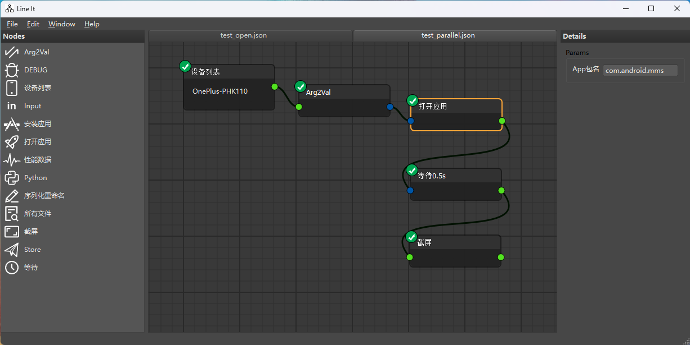

# LineIt节点编辑器

通过节点编辑器的方式来完成自动化测试相关工作流构建工作

## 如何运行

克隆项目

`git clone git@github.com:wjwABCDEFG/LineIt.git`

安装依赖

`pip install -r requirements.txt`

运行

`python main.py`

## 如何自定义节点

自定义的节点在nodes文件夹下中，项目里提供了一个名为node_example.py的模板，可以复制一份然后对应修改即可，主要步骤如下：

1. 继承BaseNode，并添加@register_node装饰器，配置好图标，title等参数
2. 自定义details细节面板(可选)
3. 重写evalOperation方法，用于eval时的计算

更高度的自定义，可以参考node_example.py

## 设计文档

如果想阅读代码细节或者详细设计，可以阅读这篇文章

https://wjw.today/Others/node-editor.md/

## 感谢

基于blenderfreak大佬的实现（https://gitlab.com/pavel.krupala/pyqt-node-editor）基础上进行开发

